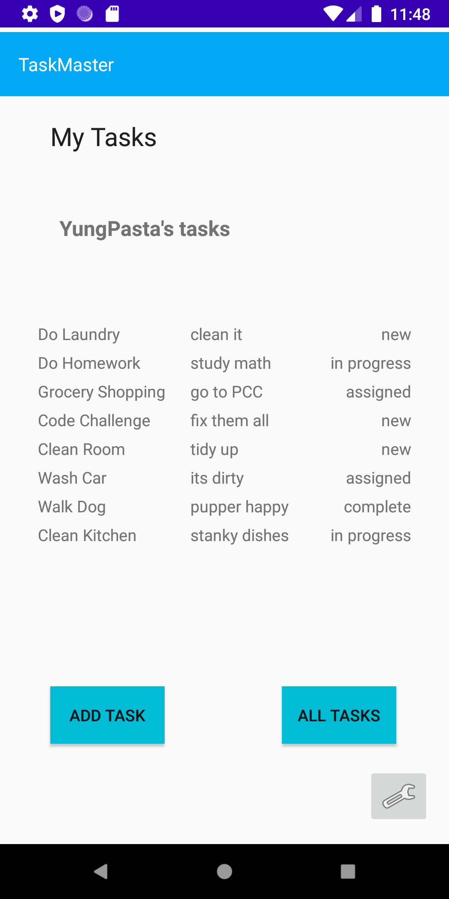
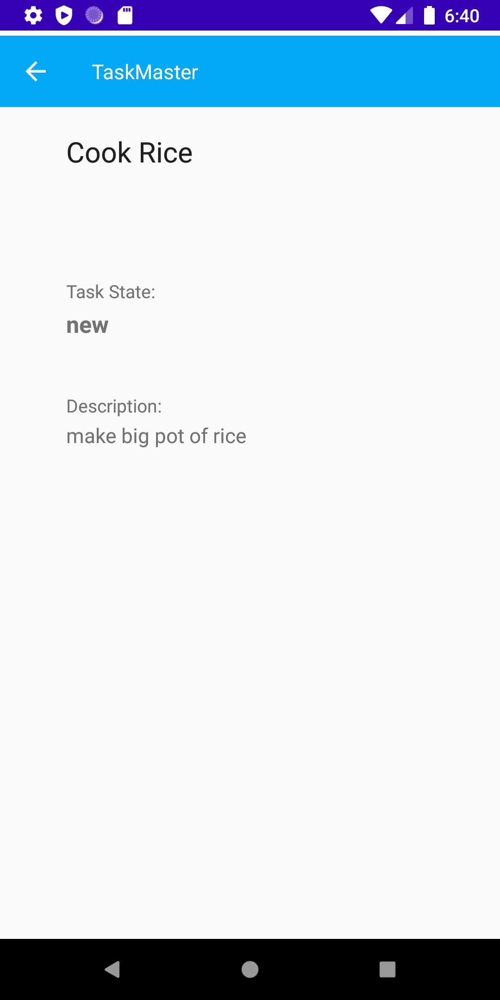

# Taskmaster App

## Overview
This app will allow a user to create and track tasks

### Operation
1. Open in Android Studio
2. Build & Press Green play button
3. Run the app from a phone emulator (Pixel 2 or 3 preferred)
4. Enjoy!

### Espresso Test Operation
1. Run each test one at a time
2. **WIPE APP MEMORY BETWEEN EVERY TEST**

### Day 1 - Initial build 
- Added 3 activity pages: main, add task, and all tasks
- linked buttons on main pages to navigate to other activity pages
- added Snackbar functionality to notify user that a task was sucessfully added

### Day 2 - Settings Page, Detail Page
- Added a settings button to home page that takes user to their settings page
- Settings page allows user to create / save a username
- Username is persistent across all pages
- Created Task detail page
- Homepage has 3 buttons hardcoded w/ a task
- Buttons on homepage navigates to "Task Detail" page with title of task

### Day 3 - Recycler Views
- Create Task Class
- Refactor homepage to use a `RecyclerView` for displaying task data
- [x] replace homepage screenshot
- [x] implement `ViewAdapter` 
- [x] `RecyclerView` displays and is tappable
- [x] homepage `RecyclerView` is clickable and sends user to Details page

### Day 4 - Room / Local Storage
- [x] Set up Room, modify `Task` to entity
- [x] `AddTask` form saves to local database
- [x] home page RecyclerView pull from database
- [x] Pull task title & description to the detail page once clicked

### Day 5 - Espresso Tests
- Added 4 Espresso Tests
    1. `DisplayUsernameTest` ensures that a username can be saved & displayed on home page
    2. `MainElementsExist` tests for UI elements
    3. `SaveTaskTest` tests for ability to save task to local storage & display in recycler view
    4. `TaskDetailTest` test task detail view

### Day 6 - Connected Amplify / Dynamo DB
- added AWS Amplify functionality
- addTask saves to cloud -> dynamo db
- homepage recycler view populates from cloud -> dynamo db

### Day 7 - Related Data
- Phasing out local database
- Refactored DynamoDB Schema
- Added radio buttons to add task to a "Team"
- TODO: flesh out full radio button functionality
- TODO: allow user to be added to a team

### Day10 (Lab 36) - Cognito
- Added AWS Cognito Auth
- Username dynamically displayed on homepage
- Added Logout functionality

### Screenshots
#### Day7 Build

