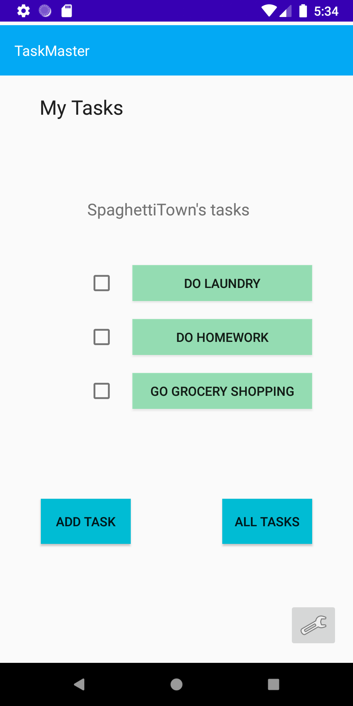
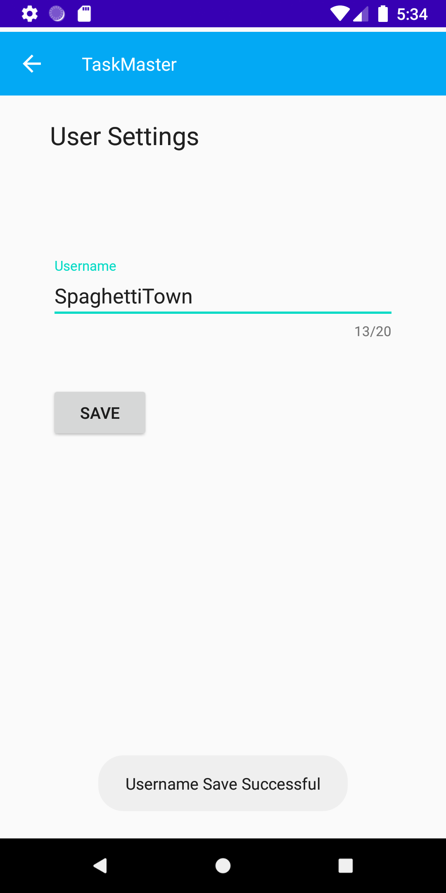
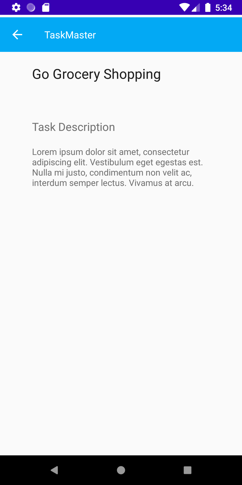
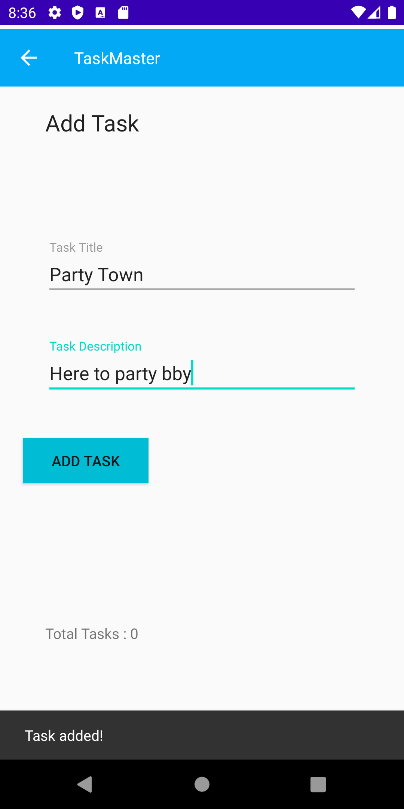
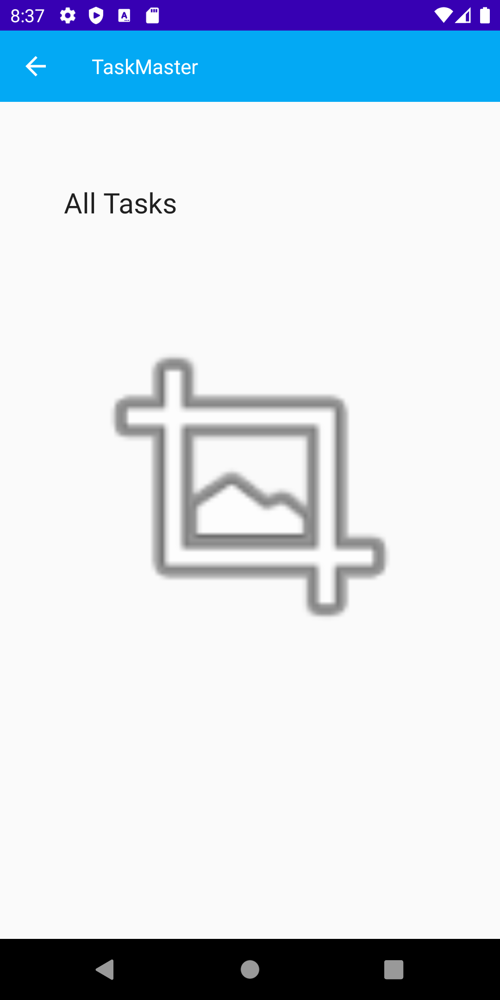

# Taskmaster App

## Overview
This app will allow a user to create and track tasks

### Operation
1. Open in Android Studio
2. Build & Press Green play button
3. Run the app from a phone emulator (Pixel 2 or 3 preferred)
4. Enjoy!

### Day 1 - Initial build 
- Added 3 activity pages: main, add task, and all tasks
- linked buttons on main pages to navigate to other activity pages
- added Snackbar functionality to notify user that a task was sucessfully added

### Day 2 - Settings Page, Detail Page
- Added a settings button to home page that takes user to their settings page
- Settings page allows user to create / save a username
- Username is persistent across all pages
- Created Task detail page
- Homepage has 3 buttons hardcoded w/ a task
- Buttons on homepage navigates to "Task Detail" page with title of task

### Day 3 - Recycler Views
- Create Task Class
- Refactor homepage to use a `RecyclerView` for displaying task data
- [x] replace homepage screenshot
- [x] implement `ViewAdapter` 
- [x] `RecyclerView` displays and is tappable
- [x] homepage `RecyclerView` is clickable and sends user to Details page

### Screenshots
#### Day2 Build

